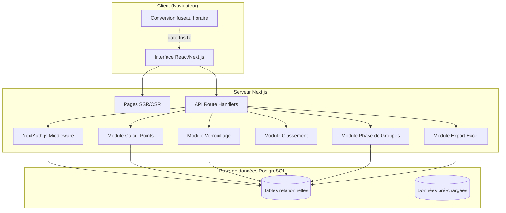
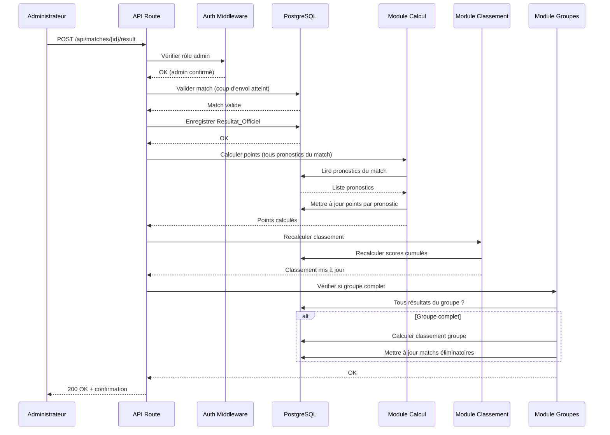

# Design Document

## Overview

Cette application web permet à un cercle d'amis de saisir des pronostics sur les matchs de la Coupe du Monde 2026. L'architecture est conçue pour un nombre restreint d'utilisateurs (10-50 participants), avec un administrateur unique gérant les résultats officiels.

### Choix technologiques

| Couche | Technologie | Justification |
|--------|-------------|---------------|
| Frontend | Next.js 14 (App Router) + React 18 | Rendu côté serveur pour la performance, routage intégré, écosystème riche |
| Langage | TypeScript | Typage statique pour la fiabilité du calcul des points |
| UI | Tailwind CSS + shadcn/ui | Design responsive, composants accessibles, personnalisation facile |
| Backend | Next.js API Routes (Route Handlers) | Monorepo simplifié, pas de serveur séparé à maintenir |
| Base de données | PostgreSQL | Intégrité relationnelle forte, transactions ACID pour le calcul des points |
| ORM | Prisma | Typage TypeScript natif, migrations déclaratives |
| Authentification | NextAuth.js (Auth.js v5) avec Credentials provider | Sessions JWT, gestion native des sessions/timeouts |
| Hachage mot de passe | bcrypt (coût 12) | Hash irréversible, standard industrie |
| Export Excel | ExcelJS | Génération .xlsx côté serveur |
| Fuseau horaire | date-fns-tz | Conversion fiable des fuseaux horaires côté client |
| Tests | Vitest + fast-check | Tests unitaires rapides + property-based testing |
| Hébergement | Vercel (ou VPS avec Docker) | Déploiement Next.js natif, PostgreSQL via Supabase/Neon |

### Décisions architecturales clés

1. **Monolithe Next.js** : Pour un groupe d'amis, une architecture microservices serait surdimensionnée. Un monolithe fullstack simplifie le déploiement et la maintenance.
2. **Données pré-chargées en seed** : Le calendrier de la Coupe du Monde 2026 et la liste des joueurs sont extraits des fichiers PDF source (`World_Cup_2026_standings_en.pdf` et `SquadLists-English.pdf` à la racine du projet), convertis en fichiers JSON intermédiaires (`data/teams.json`, `data/matches.json`, `data/players.json`), puis insérés en base via un script de seed Prisma.
3. **Calcul synchrone des points** : Avec ~50 participants et ~64 matchs, le recalcul est instantané (< 5s garanti) sans nécessiter de file d'attente.
4. **Verrouillage par étape** : La logique de clôture compare l'heure serveur (UTC) à l'heure de clôture stockée pour chaque étape.

## Architecture

### Diagramme d'architecture haut niveau



### Diagramme de flux : Saisie d'un résultat officiel



### Modules principaux

| Module | Responsabilité |
|--------|---------------|
| `auth` | Inscription, connexion, sessions, verrouillage tentatives |
| `matches` | CRUD matchs, affichage calendrier, statuts |
| `pronostics` | Saisie, modification, verrouillage, confidentialité |
| `results` | Saisie résultats officiels (admin), validation |
| `scoring` | Calcul des points par pronostic selon le barème |
| `ranking` | Classement global, scores cumulés |
| `groups` | Classement phase de groupes, qualification éliminatoire |
| `rewards` | Récompenses individuelles, pronostics bonus |
| `export` | Génération fichier Excel |
| `navigation` | Navigation par journée/tour, état visuel |

## Components and Interfaces

### Structure du projet

```
src/
├── app/
│   ├── (auth)/
│   │   ├── connexion/page.tsx
│   │   └── inscription/page.tsx
│   ├── (main)/
│   │   ├── calendrier/page.tsx
│   │   ├── pronostics/page.tsx
│   │   ├── classement/page.tsx
│   │   ├── recompenses/page.tsx
│   │   └── admin/
│   │       ├── resultats/page.tsx
│   │       ├── participants/page.tsx
│   │       ├── recompenses/page.tsx
│   │       └── export/page.tsx
│   ├── api/
│   │   ├── auth/[...nextauth]/route.ts
│   │   ├── matches/route.ts
│   │   ├── matches/[id]/result/route.ts
│   │   ├── pronostics/route.ts
│   │   ├── pronostics/[matchId]/route.ts
│   │   ├── classement/route.ts
│   │   ├── recompenses/route.ts
│   │   ├── recompenses/[id]/winner/route.ts
│   │   └── admin/export/route.ts
│   └── layout.tsx
├── lib/
│   ├── scoring.ts          # Module calcul des points
│   ├── ranking.ts          # Module classement
│   ├── group-ranking.ts    # Classement phase de groupes
│   ├── lock.ts             # Logique de verrouillage
│   ├── validation.ts       # Validation des entrées
│   └── timezone.ts         # Utilitaires fuseau horaire
├── components/
│   ├── ui/                 # Composants shadcn/ui
│   ├── match-card.tsx
│   ├── pronostic-form.tsx
│   ├── classement-table.tsx
│   ├── navigation-stages.tsx
│   ├── score-indicator.tsx
│   └── stats-summary.tsx
├── prisma/
│   ├── schema.prisma
│   ├── seed.ts             # Seed calendrier + joueurs
│   └── migrations/
└── types/
    └── index.ts
```

### Interfaces principales

```typescript
// === Types de domaine ===

interface Participant {
  id: string;
  email: string;
  displayName: string;
  passwordHash: string;
  isAdmin: boolean;
  createdAt: Date;
}

interface Match {
  id: string;
  phase: 'GROUP' | 'KNOCKOUT';
  stage: Stage;
  group?: string;              // 'A' à 'L' pour la phase de groupes
  homeTeam?: string;           // null si pas encore déterminé (éliminatoire)
  awayTeam?: string;
  homePlaceholder?: string;    // ex: "1er Groupe A"
  awayPlaceholder?: string;    // ex: "2e Groupe B"
  kickoffTime: Date;           // UTC
  officialResult?: OfficialResult;
}

type Stage =
  | 'GROUP_DAY_1' | 'GROUP_DAY_2' | 'GROUP_DAY_3'
  | 'ROUND_OF_16' | 'QUARTER_FINAL' | 'SEMI_FINAL'
  | 'THIRD_PLACE' | 'FINAL';

interface OfficialResult {
  id: string;
  matchId: string;
  homeGoals: number;
  awayGoals: number;
  penaltyWinner?: 'HOME' | 'AWAY'; // Uniquement si match nul en éliminatoire
  createdAt: Date;
  updatedAt: Date;
}

interface Pronostic {
  id: string;
  participantId: string;
  matchId: string;
  homeGoals: number;
  awayGoals: number;
  points?: number;             // null tant que pas de résultat officiel
  createdAt: Date;
  updatedAt: Date;
}

interface RewardPrediction {
  id: string;
  participantId: string;
  rewardType: RewardType;
  playerId: string;
  points?: number;
  createdAt: Date;
  updatedAt: Date;
}

type RewardType =
  | 'GOLDEN_BOOT' | 'GOLDEN_BALL' | 'GOLDEN_GLOVE'
  | 'BEST_YOUNG' | 'FAIR_PLAY';

interface Player {
  id: string;
  name: string;
  team: string;
  position: string;
}

// === Interfaces du Module Calcul Points ===

interface ScoringResult {
  correctOutcome: boolean;     // +1 point
  correctDifference: boolean;  // +1 point
  exactScore: boolean;         // +1 point
  totalPoints: number;         // 0 à 3
}

function calculatePoints(
  pronostic: { homeGoals: number; awayGoals: number },
  result: { homeGoals: number; awayGoals: number }
): ScoringResult;

// === Interface du Module Classement Groupes ===

interface GroupStanding {
  team: string;
  played: number;
  won: number;
  drawn: number;
  lost: number;
  goalsFor: number;
  goalsAgainst: number;
  goalDifference: number;
  points: number;
  position: number;
}

function calculateGroupStandings(
  group: string,
  results: OfficialResult[]
): GroupStanding[];

// === Interface du Module Classement Global ===

interface RankingEntry {
  participantId: string;
  displayName: string;
  totalPoints: number;
  rank: number;
}

function calculateRanking(
  participants: Participant[],
  pronostics: Pronostic[],
  rewardPredictions: RewardPrediction[]
): RankingEntry[];
```

### API Routes

| Méthode | Route | Description | Accès |
|---------|-------|-------------|-------|
| POST | `/api/auth/register` | Création de compte | Public |
| POST | `/api/auth/[...nextauth]` | Connexion/déconnexion | Public |
| GET | `/api/matches` | Liste des matchs (avec filtrage par étape) | Authentifié |
| GET | `/api/matches/[id]` | Détail d'un match | Authentifié |
| POST | `/api/matches/[id]/result` | Saisie résultat officiel | Admin |
| GET | `/api/pronostics` | Mes pronostics | Authentifié |
| PUT | `/api/pronostics/[matchId]` | Saisir/modifier un pronostic | Authentifié |
| GET | `/api/pronostics/participant/[id]` | Pronostics d'un autre participant | Authentifié |
| GET | `/api/classement` | Classement global | Authentifié |
| GET | `/api/recompenses` | État des récompenses | Authentifié |
| PUT | `/api/recompenses/[type]` | Saisir pronostic récompense | Authentifié |
| POST | `/api/recompenses/[type]/winner` | Désigner vainqueur | Admin |
| GET | `/api/admin/participants` | Liste admin des participants | Admin |
| GET | `/api/admin/participants/[id]/pronostics` | Vue admin pronostics | Admin |
| GET | `/api/admin/export` | Générer export Excel | Admin |
| GET | `/api/stats/[matchId]` | Statistiques des pronostics | Authentifié |

## Data Models

### Schéma Prisma

```prisma
model Participant {
  id            String   @id @default(cuid())
  email         String   @unique
  displayName   String
  passwordHash  String
  isAdmin       Boolean  @default(false)
  createdAt     DateTime @default(now())

  pronostics        Pronostic[]
  rewardPredictions RewardPrediction[]
  loginAttempts     LoginAttempt[]
}

model LoginAttempt {
  id            String   @id @default(cuid())
  participantId String?
  email         String
  success       Boolean
  attemptedAt   DateTime @default(now())
  participant   Participant? @relation(fields: [participantId], references: [id])

  @@index([email, attemptedAt])
}

model Team {
  id       String @id @default(cuid())
  name     String @unique
  code     String @unique  // Code ISO 3 lettres
  group    String          // 'A' à 'L'
  flagUrl  String          // Chemin vers le drapeau intégré
}

model Player {
  id       String @id @default(cuid())
  name     String
  teamCode String
  position String          // 'GK', 'DF', 'MF', 'FW'

  @@index([teamCode])
}

model Match {
  id              String   @id @default(cuid())
  phase           Phase
  stage           Stage
  groupCode       String?         // Groupe pour la phase de groupes
  homeTeamCode    String?         // null si pas encore déterminé
  awayTeamCode    String?
  homePlaceholder String?         // ex: "1er Groupe A"
  awayPlaceholder String?
  kickoffTime     DateTime        // Stocké en UTC
  matchNumber     Int     @unique // Numéro unique du match FIFA

  officialResult  OfficialResult?
  pronostics      Pronostic[]

  @@index([stage])
  @@index([kickoffTime])
  @@index([groupCode])
}

model OfficialResult {
  id            String   @id @default(cuid())
  matchId       String   @unique
  homeGoals     Int
  awayGoals     Int
  penaltyWinner PenaltyWinner?  // Vainqueur TAB si nul en éliminatoire
  createdAt     DateTime @default(now())
  updatedAt     DateTime @updatedAt

  match         Match    @relation(fields: [matchId], references: [id])
}

model Pronostic {
  id            String   @id @default(cuid())
  participantId String
  matchId       String
  homeGoals     Int
  awayGoals     Int
  points        Int?     // null = pas encore évalué
  createdAt     DateTime @default(now())
  updatedAt     DateTime @updatedAt

  participant   Participant @relation(fields: [participantId], references: [id])
  match         Match       @relation(fields: [matchId], references: [id])

  @@unique([participantId, matchId])
}

model RewardPrediction {
  id            String     @id @default(cuid())
  participantId String
  rewardType    RewardType
  playerId      String
  points        Int?       // null = pas encore évalué, 0 ou 5
  createdAt     DateTime   @default(now())
  updatedAt     DateTime   @updatedAt

  participant   Participant @relation(fields: [participantId], references: [id])

  @@unique([participantId, rewardType])
}

model RewardResult {
  id         String     @id @default(cuid())
  rewardType RewardType @unique
  playerId   String
  createdAt  DateTime   @default(now())
  updatedAt  DateTime   @updatedAt
}

model RegistrationStatus {
  id        String  @id @default("singleton")
  isClosed  Boolean @default(false)
}

enum Phase {
  GROUP
  KNOCKOUT
}

enum Stage {
  GROUP_DAY_1
  GROUP_DAY_2
  GROUP_DAY_3
  ROUND_OF_16
  QUARTER_FINAL
  SEMI_FINAL
  THIRD_PLACE
  FINAL
}

enum PenaltyWinner {
  HOME
  AWAY
}

enum RewardType {
  GOLDEN_BOOT
  GOLDEN_BALL
  GOLDEN_GLOVE
  BEST_YOUNG
  FAIR_PLAY
}
```

### Relations et contraintes

```mermaid
erDiagram
    Participant ||--o{ Pronostic : "saisit"
    Participant ||--o{ RewardPrediction : "prédit"
    Participant ||--o{ LoginAttempt : "tente"
    Match ||--o{ Pronostic : "concerne"
    Match ||--o| OfficialResult : "a"
    Team ||--o{ Player : "contient"

    Participant {
        string id PK
        string email UK
        string displayName
        string passwordHash
        boolean isAdmin
    }

    Match {
        string id PK
        Phase phase
        Stage stage
        string homeTeamCode FK
        string awayTeamCode FK
        datetime kickoffTime
        int matchNumber UK
    }

    Pronostic {
        string id PK
        string participantId FK
        string matchId FK
        int homeGoals
        int awayGoals
        int points
    }

    OfficialResult {
        string id PK
        string matchId FK UK
        int homeGoals
        int awayGoals
        PenaltyWinner penaltyWinner
    }
```

### Règles de verrouillage

Le verrouillage est calculé dynamiquement :

```typescript
function getStageLockTime(stage: Stage): Date {
  // Retourne kickoffTime du premier match de l'étape - 1 heure
  const firstMatch = await getFirstMatchOfStage(stage);
  return subHours(firstMatch.kickoffTime, 1);
}

function isStageOpen(stage: Stage): boolean {
  const lockTime = getStageLockTime(stage);
  return new Date() < lockTime;
}
```

### Règles d'inscription

```typescript
function isRegistrationOpen(): boolean {
  // Vérifie directement si tous les matchs de la Journée 1 ont un résultat
  const day1Matches = await getMatchesByStage('GROUP_DAY_1');
  const allHaveResult = day1Matches.every(m => m.officialResult !== null);
  return !allHaveResult;
}
```

## Correctness Properties

*A property is a characteristic or behavior that should hold true across all valid executions of a system — essentially, a formal statement about what the system should do. Properties serve as the bridge between human-readable specifications and machine-verifiable correctness guarantees.*

### Property 1: Scoring correctness (barème complet)

*For any* pair (pronostic, resultat_officiel) where both homeGoals and awayGoals are integers in [0, 99], the function `calculatePoints` SHALL return a `ScoringResult` where:
- `correctOutcome` is true if and only if `outcome(pronostic) == outcome(result)` (where outcome is HOME_WIN, DRAW, or AWAY_WIN based on goal comparison)
- `correctDifference` is true if and only if `(pronostic.homeGoals - pronostic.awayGoals) == (result.homeGoals - result.awayGoals)`
- `exactScore` is true if and only if `pronostic.homeGoals == result.homeGoals AND pronostic.awayGoals == result.awayGoals`
- `totalPoints` equals the count of true values among [correctOutcome, correctDifference, exactScore] and is always in [0, 3]

**Validates: Requirements 8.2, 8.3, 8.4, 8.5, 8.7, 8.8**

### Property 2: Exact score implies all sub-criteria

*For any* pair (pronostic, resultat_officiel) where `pronostic.homeGoals == result.homeGoals AND pronostic.awayGoals == result.awayGoals`, the function `calculatePoints` SHALL return `correctOutcome = true`, `correctDifference = true`, `exactScore = true`, and `totalPoints = 3`.

**Validates: Requirements 8.4**

### Property 3: Knockout draw outcome for penalty shootouts

*For any* knockout match result where `homeGoals == awayGoals` (match ended in penalties), and *for any* pronostic predicting a draw (any equal score), `calculatePoints` SHALL return `correctOutcome = true`.

**Validates: Requirements 8.10**

### Property 4: Group standings tiebreaker correctness

*For any* valid set of 6 match results within a group of 4 teams (each team plays 3 matches), the function `calculateGroupStandings` SHALL produce an ordering of 4 teams where:
- Teams are first sorted by points (3 for win, 1 for draw, 0 for loss) descending
- Ties are broken by goal difference descending, then goals scored descending
- Further ties are broken by head-to-head points, then head-to-head goal difference, then head-to-head goals scored
- Final tiebreaker is alphabetical order of team name
- The resulting positions are 1, 2, 3, 4 with no gaps

**Validates: Requirements 3.3, 3.11**

### Property 5: Match sorting invariant

*For any* list of matches, the sorted output SHALL have `kickoffTime` in non-decreasing order, and *for any* two matches sharing the same `kickoffTime`, the home team name (or placeholder) of the first SHALL be lexicographically ≤ that of the second.

**Validates: Requirements 3.7**

### Property 6: Stage lock time calculation

*For any* stage containing at least one match, the lock time SHALL equal the earliest `kickoffTime` among all matches of that stage minus exactly 1 hour. All matches within a stage share the same lock status.

**Validates: Requirements 5.1, 5.2**

### Property 7: Pronostic lock enforcement

*For any* stage and any point in time, a pronostic create/modify operation on a match of that stage SHALL succeed if and only if the current time is strictly before the stage's lock time.

**Validates: Requirements 5.3, 5.4, 5.5, 5.6**

### Property 8: Pronostic confidentiality

*For any* match and any two distinct participants A and B, participant A's pronostic for that match SHALL be invisible to participant B if and only if the match's kickoff time has not been reached. A participant SHALL always see their own pronostics regardless of time.

**Validates: Requirements 6.1, 6.2, 6.3**

### Property 9: Ranking calculation

*For any* set of participants with evaluated pronostics and reward predictions, the ranking SHALL:
- Compute each participant's total score as the sum of all match points (0-3 each) plus all reward bonus points (0 or 5 each)
- Sort participants by total score descending
- Assign rank = 1 + count of participants with strictly higher score (tied participants get same rank)
- Sort tied participants by display name alphabetically

**Validates: Requirements 9.1, 9.2, 9.4, 18.11**

### Property 10: Registration closure

*For any* state of the database, `isRegistrationOpen()` SHALL return false if and only if every match in `GROUP_DAY_1` has an associated `OfficialResult`. This check SHALL be computed directly from match/result data (not from a cached flag alone).

**Validates: Requirements 1.10**

### Property 11: Input validation — account creation

*For any* string submitted as email that does not match the standard email format or exceeds 254 characters, OR *for any* display name outside 3-30 characters or containing characters other than letters/digits/spaces/hyphens/underscores, OR *for any* password outside 8-64 characters, the registration function SHALL reject the submission. Conversely, *for any* inputs meeting all constraints with a unique email, registration SHALL succeed.

**Validates: Requirements 1.1, 1.3, 1.4, 1.6, 1.7**

### Property 12: Input validation — goal scores

*For any* value submitted as a goal count that is not an integer, is negative, or exceeds 99, both pronostic submission and official result submission SHALL be rejected. *For any* integer in [0, 99], submission SHALL be accepted (given other preconditions are met).

**Validates: Requirements 4.1, 4.4, 7.1, 7.6**

### Property 13: Uniqueness constraint

*For any* sequence of pronostic operations on a given (participant, match) pair, the database SHALL contain at most one pronostic record. Similarly, *for any* (participant, rewardType) pair, at most one reward prediction SHALL exist.

**Validates: Requirements 4.3, 18.4**

### Property 14: Password hashing irreversibility

*For any* password string, the stored hash SHALL differ from the original password, and `verify(password, hash)` SHALL return true. For any other string ≠ password, `verify(otherString, hash)` SHALL return false with overwhelming probability.

**Validates: Requirements 1.5**

### Property 15: Authorization enforcement

*For any* protected resource requiring a specific role (admin) and *for any* authenticated user without that role, access SHALL be denied. Specifically: result submission, reward winner designation, admin participant view, and Excel export SHALL reject non-admin users.

**Validates: Requirements 7.4, 14.5, 18.15**

### Property 16: Account lockout after failed attempts

*For any* email address, after 5 consecutive failed login attempts, the system SHALL reject all subsequent login attempts for that email for exactly 15 minutes, regardless of whether credentials are valid. The counter SHALL reset only after the 15-minute period expires.

**Validates: Requirements 2.3**

### Property 17: Reward prediction scoring

*For any* reward prediction and official reward winner, the system SHALL award exactly 5 bonus points if `prediction.playerId == winner.playerId`, and exactly 0 bonus points otherwise.

**Validates: Requirements 18.9, 18.10**

### Property 18: Statistics aggregation correctness

*For any* set of pronostics for a closed match, the statistical summary SHALL:
- Count each distinct score (homeGoals-awayGoals) correctly
- Sum of all individual score counts SHALL equal total number of pronostics
- Be sorted by count descending, then by score string lexicographically ascending for ties

**Validates: Requirements 16.1, 16.2**

### Property 19: Duplicate email rejection

*For any* valid email address that already exists in the database, a registration attempt with that same email SHALL be rejected regardless of other field values.

**Validates: Requirements 1.2**

### Property 20: Match status determination

*For any* match, the status SHALL be "à venir" if current time < kickoffTime, "en cours" if current time >= kickoffTime AND no OfficialResult exists, and "terminé" if an OfficialResult exists.

**Validates: Requirements 3.9**

## Error Handling

### Stratégie globale

| Catégorie | Comportement |
|-----------|-------------|
| Erreur de validation | Retour 400 avec message explicite en français, données du formulaire préservées |
| Erreur d'authentification | Retour 401, redirection vers connexion |
| Erreur d'autorisation | Retour 403 avec message indiquant que l'action est réservée à l'Administrateur |
| Erreur technique (DB, réseau) | Retour 500, message générique "Une erreur est survenue, veuillez réessayer", log serveur détaillé |
| Timeout calcul (> 5s) | Annulation, log d'alerte, message d'erreur à l'admin |

### Messages d'erreur en français

```typescript
const ERROR_MESSAGES = {
  // Inscription
  EMAIL_INVALID: "Le format de l'adresse e-mail est invalide.",
  EMAIL_TAKEN: "Cette adresse e-mail est déjà utilisée.",
  PASSWORD_LENGTH: "Le mot de passe doit contenir entre 8 et 64 caractères.",
  PASSWORD_MISMATCH: "Les deux champs mot de passe doivent être identiques.",
  DISPLAY_NAME_INVALID: "Le nom d'affichage doit contenir entre 3 et 30 caractères (lettres, chiffres, espaces, tirets ou underscores uniquement).",
  REGISTRATION_CLOSED: "Les inscriptions sont closes.",

  // Connexion
  INVALID_CREDENTIALS: "Identifiants invalides.",
  ACCOUNT_LOCKED: "Tentatives de connexion temporairement bloquées. Réessayez dans 15 minutes.",
  FIELDS_REQUIRED: "L'adresse e-mail et le mot de passe sont obligatoires.",

  // Pronostics
  GOALS_INVALID: "Veuillez saisir un nombre entier compris entre 0 et 99 pour chaque équipe.",
  STAGE_LOCKED: "Les pronostics de cette étape sont clôturés.",
  MATCH_NOT_AVAILABLE: "Ce match n'est pas encore disponible pour la saisie de pronostics.",

  // Résultats
  ADMIN_ONLY: "Cette opération est réservée à l'Administrateur.",
  KICKOFF_NOT_REACHED: "Le coup d'envoi de ce match n'est pas encore atteint.",
  PENALTY_WINNER_REQUIRED: "Le vainqueur aux tirs au but doit être sélectionné.",

  // Récompenses
  REWARDS_LOCKED: "Les pronostics de récompenses sont clôturés.",

  // Technique
  TECHNICAL_ERROR: "Une erreur technique est survenue. Veuillez réessayer.",
  GROUP_CALC_FAILED: "Le calcul du classement du groupe a échoué. Veuillez vérifier les résultats saisis.",
  EXPORT_FAILED: "L'export a échoué. Veuillez réessayer.",
} as const;
```

### Gestion des transactions

Les opérations critiques utilisent des transactions PostgreSQL :

1. **Saisie d'un résultat officiel** : enregistrement du résultat + calcul des points + mise à jour du classement dans une seule transaction.
2. **Qualification éliminatoire** : calcul du classement de groupe + mise à jour des matchs éliminatoires dans une seule transaction.
3. **Inscription** : vérification d'unicité email + création du compte dans une seule transaction.

### Indicateurs de chargement

Toute opération dépassant 300ms affiche un spinner ou une barre de progression. Implémenté via :
- État `isLoading` dans les composants React
- Composant `<LoadingIndicator />` global
- Transitions optimistes pour les opérations rapides

## Testing Strategy

### Approche duale

L'application combine deux stratégies de test complémentaires :

| Type | Outil | Objectif |
|------|-------|----------|
| Property-based tests | fast-check + Vitest | Vérifier les propriétés universelles (calcul des points, classement, validation) |
| Unit tests | Vitest | Vérifier des exemples spécifiques et cas limites |
| Integration tests | Vitest + Prisma (SQLite test) | Vérifier les flux complets (inscription → connexion → pronostic → résultat → points) |
| E2E tests | Playwright | Vérifier les parcours utilisateur sur navigateur |

### Property-Based Testing

**Bibliothèque** : fast-check (TypeScript)
**Configuration** : minimum 100 itérations par propriété

Chaque test de propriété est taggé avec un commentaire référençant le document de design :

```typescript
// Feature: pronostics-coupe-du-monde, Property 1: Scoring correctness
test.prop([goalArb, goalArb, goalArb, goalArb], { numRuns: 100 })(
  'calculatePoints returns correct scoring result for any valid inputs',
  (homeProno, awayProno, homeResult, awayResult) => {
    const result = calculatePoints(
      { homeGoals: homeProno, awayGoals: awayProno },
      { homeGoals: homeResult, awayGoals: awayResult }
    );
    // Verify all scoring rules...
  }
);
```

### Modules prioritaires pour PBT

| Module | Propriétés testées |
|--------|--------------------|
| `lib/scoring.ts` | Properties 1, 2, 3 |
| `lib/group-ranking.ts` | Property 4 |
| `lib/ranking.ts` | Property 9 |
| `lib/lock.ts` | Properties 6, 7 |
| `lib/validation.ts` | Properties 11, 12, 14, 16, 19 |
| `lib/stats.ts` | Property 18 |

### Tests unitaires (exemples spécifiques)

- Résultat 2-1, pronostic 2-1 → 3 points (score exact)
- Résultat 2-1, pronostic 3-2 → 2 points (bonne issue + bonne différence)
- Résultat 2-1, pronostic 1-0 → 2 points (bonne issue + bonne différence)
- Résultat 2-1, pronostic 3-0 → 1 point (bonne issue seule)
- Résultat 2-1, pronostic 0-0 → 0 point
- Résultat 1-1 (éliminatoire, TAB), pronostic 2-2 → 2 points (bonne issue + bonne différence)
- Résultat 1-1 (éliminatoire, TAB), pronostic 0-0 → 1 point (bonne issue seule)

### Tests d'intégration

- Flux complet : inscription → connexion → saisie pronostic → résultat officiel → points calculés → classement mis à jour
- Qualification éliminatoire : saisie de tous les résultats d'un groupe → matchs éliminatoires mis à jour
- Verrouillage : tentative de modification après clôture → rejet
- Export Excel : génération avec données réalistes → vérification contenu

### Tests E2E (Playwright)

- Parcours mobile : inscription, connexion, navigation par étape, saisie pronostic
- Parcours admin : connexion, saisie résultat, vérification classement mis à jour
- Responsive : vérification sur 3 viewports (mobile 375px, tablette 768px, desktop 1280px)

